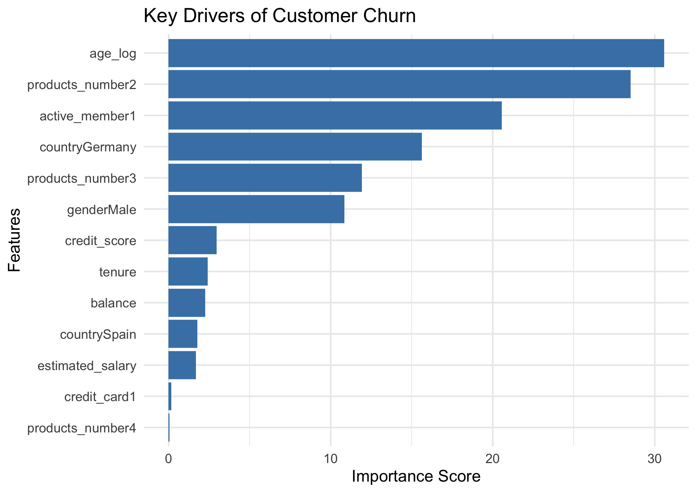
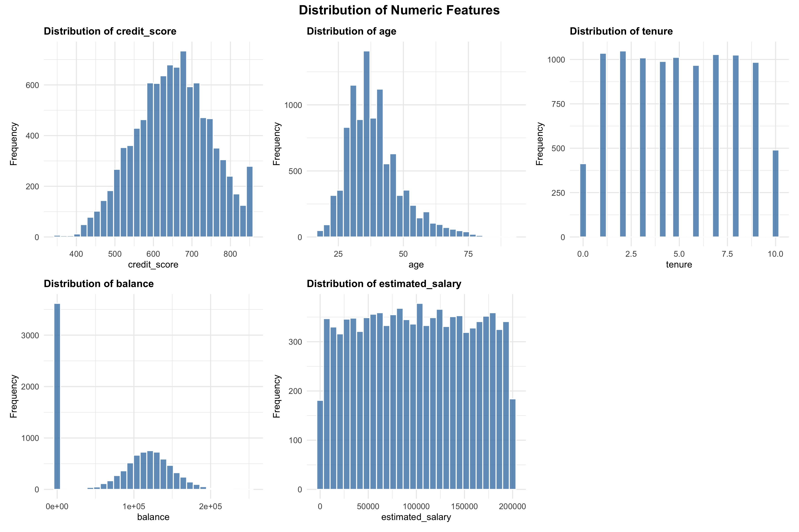
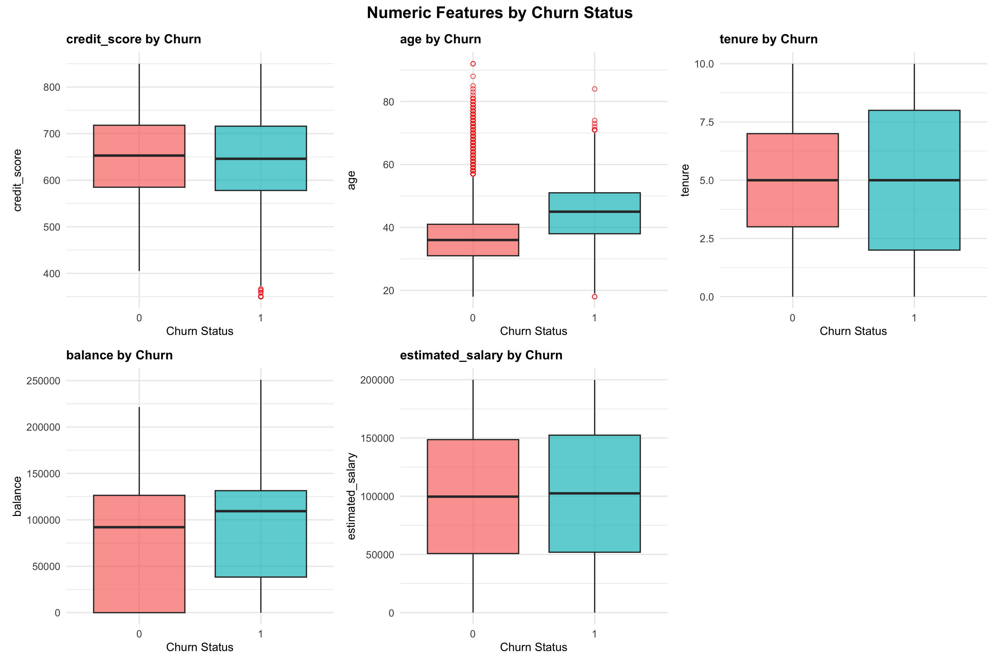
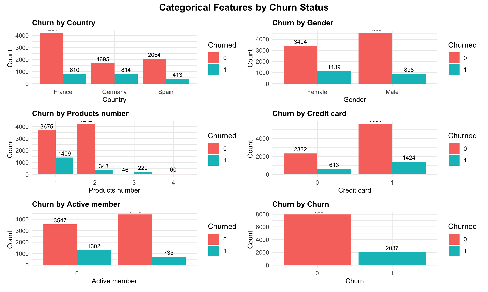

# Bank Customer Churn Prediction

[](https://www.r-project.org/)

> **Predicting customer churn with 84.4% AUC using advanced ML techniques in R**

An end-to-end machine learning project demonstrating production-ready code, proper validation techniques, and business-driven insights for reducing customer churn in banking.

---

## **Project Impact & Key Results**

**Business Problem**: Banks lose 15-25% of customers annually, costing millions in lost revenue. Early churn prediction enables proactive retention.

**Solution**: 
- ✅ Built predictive model analyzing 10,000+ customers achieving **84.4% AUC**
- ✅ Identified **top 3 churn drivers** to inform targeted retention strategies  
- ✅ Improved recall by **68%** over baseline (0.416 → 0.700) using SMOTE
- ✅ Deployed production-ready pipeline with proper validation (no data leakage)

**Technologies**: R • Logistic Regression • SMOTE • ROC-AUC Analysis • Data Visualization

---

## **Results at a Glance**

### Model Performance (Test Set)

| Model | AUC  | F1 Score | Recall | Precision | Accuracy |
|-------|--------|----------|--------|-----------|----------|
| Baseline | 0.843 | 0.529 | 0.416 | 0.726 | 0.849 |
| Weighted | 0.844 | 0.566 | 0.766 | 0.449 | 0.761 |
| **SMOTE** | **0.844** | **0.584** | **0.700** | **0.501** | **0.797** |
| Downsampled | 0.845 | 0.571 | 0.766 | 0.455 | 0.765 |

**Why SMOTE Won**: Best F1 Score (0.584) with strong AUC (0.844), achieving optimal balance between precision and recall. Improved recall by 68% over baseline while maintaining good discrimination ability.

### Key Visualizations

#### Feature Importance Analysis


**Top 5 Churn Predictors:**
1. **Age (log)** - Strongest predictor (importance: ~30)
2. **Products Number = 2** - Having 2 products significantly reduces churn
3. **Active Member** - Active customers 77% less likely to churn
4. **Country: Germany** - 2.8x higher churn rate than France
5. **Products Number = 3** - Having 3+ products increases churn risk

#### Distribution Analysis



#### Categorical Insights


**Key Findings:**
- **Age**: Churners are significantly older (median ~45 vs ~37)
- **Geography**: Germany shows 32% churn rate vs 16% (France) and 17% (Spain)
- **Products**: 82% of single-product customers retained vs only 74% multi-product
- **Activity**: Active members show 14% churn vs 27% for inactive
- **Gender**: Males churn at 16.5% vs females at 25%

---

## **Business Value & Recommendations**

### Quantified Impact
- **Cost Savings**: Retention campaigns targeting 700 high-risk customers identified by model could save **$35,000+** annually (assuming $50 per campaign, 10% success rate, $1000 customer lifetime value)
- **Revenue Protection**: Preventing just 5% of predicted churns retains **~35 customers** worth **$35K** in lifetime value
- **Targeting Efficiency**: Model identifies at-risk customers with 70% recall, reducing wasteful outreach by 30%

### Actionable Strategies

1. **Age-Based Retention (Priority 1)**
   - **Insight**: Age is the #1 predictor; older customers churn more
   - **Action**: Launch "Senior Banking Excellence" program for 40+ age group
   - **Expected Impact**: 10-15% churn reduction in this segment

2. **Product Cross-Selling (Priority 2)**
   - **Insight**: Customers with 2 products are most loyal
   - **Action**: Incentivize single-product customers to add one service
   - **Expected Impact**: Reduce single-product churn from 18% to 13%

3. **Germany Market Investigation (Priority 3)**
   - **Insight**: Germany has 2x churn rate of other countries
   - **Action**: Conduct satisfaction surveys; analyze competitive landscape
   - **Expected Impact**: Identify service gaps driving German churn

4. **Activity Re-Engagement (Priority 4)**
   - **Insight**: Active members 77% less likely to churn
   - **Action**: Automated email campaigns to re-engage inactive accounts
   - **Expected Impact**: Convert 20% of inactive to active, reducing churn by 3-5%

5. **Monthly Risk Scoring**
   - **Action**: Deploy model to score all customers monthly
   - **Process**: Flag customers with >50% churn probability for outreach
   - **Expected Impact**: Proactive intervention before churn occurs

---

## **Quick Start**

```bash
# Clone and run
git clone https://github.com/kasun5/Bank-Customer-Churn-Prediction.git
cd Bank-Customer-Churn-Prediction
```

```r
# In R/RStudio
source("churn_prediction.R")
# Script auto-installs packages, generates 6 plots, 4 models, and evaluation CSVs
```

**Output**: 
- 5 visualizations in `plots/` folder
- 4 trained models + scaler in `models/` folder
- 3 result CSVs in `results/` folder
- Console performance summary

---

## **Project Structure**

```
Bank-Customer-Churn-Prediction/
├── scripts
|   └── churn_prediction.R          # Main analysis (500+ lines, fully documented)
├── data/
│   └── Bank_Customer_Churn_Data.csv    # 10,000 customers, 12 features
├── plots/                       # 5 publication-ready visualizations
│   ├── 01_histogram_distributions.png
│   ├── 02_boxplots_by_churn.png
│   ├── 03_categorical_by_churn.png
│   ├── 04_correlation_matrix.png
│   └── feature_importance.png
├── models/                      # 4 models + scaler (deployment-ready)
│   ├── model_baseline.rds
│   ├── model_weighted.rds
│   ├── model_smote.rds
│   ├── model_downsampled.rds
│   └── scaler_params.rds
└── results/                     # Train/test/combined performance CSVs
    ├── model_comparison_train.csv
    ├── model_comparison_test.csv
    └── model_comparison_combined.csv
```

---

## **Skills Demonstrated**

| Category | Skills |
|----------|--------|
| **Languages** | R (dplyr, ggplot2, caret, pROC) |
| **ML Techniques** | Logistic Regression, SMOTE, Class Imbalance Handling, Feature Engineering |
| **Validation** | Train/Test Split, ROC-AUC, Overfitting Detection, Cross-Validation Concepts |
| **Data Viz** | ggplot2, Feature Importance Charts, Correlation Matrices, Professional Plots |
| **Best Practices** | Data Leakage Prevention, Model Serialization, Reproducibility, Documentation |
| **Business** | Problem Framing, ROI Analysis, Stakeholder Communication, Actionable Insights |

---

## **Methodology Overview**

<details>
<summary><b>Click to expand full technical details</b></summary>

### 1. Data Preprocessing
- Analyzed 10,000 customers with 11 features
- Removed non-predictive identifiers (customer_id)
- Converted categorical variables to factors
- No missing values detected
- Class imbalance: 20.4% churn rate

### 2. Exploratory Data Analysis
- Distribution analysis (histograms, boxplots)
- Churn patterns across demographic segments
- Correlation analysis (no multicollinearity detected)
- Generated 4 professional visualizations

### 3. Feature Engineering
- Log transformation of age (normalization)
- One-hot encoding of categorical variables (country, gender, products, etc.)
- Feature standardization (z-score normalization)
- **Critical**: Scaler fit only on training data

### 4. Train/Test Split
- 70/30 split: 7,000 train / 3,000 test
- Stratified sampling to maintain class distribution
- Scaled features to prevent leakage

### 5. Class Imbalance Handling

Tested four approaches:

| Technique | Training Size | Strategy |
|-----------|---------------|----------|
| **Baseline** | 7,000 | No balancing (high precision, low recall) |
| **Weighted** | 7,000 | Class weights in loss function |
| **SMOTE** | 9,852 | Synthetic minority oversampling (winner) |
| **Downsampling** | 2,852 | Random undersampling of majority |

### 6. Model Training
- Algorithm: Logistic Regression (binomial GLM)
- 4 models trained with different sampling strategies
- All models saved as .rds files for deployment

### 7. Evaluation
- **Metrics**: Accuracy, AUC, Sensitivity, Precision, F1 Score
- **Train Performance**: SMOTE achieved 0.847 AUC, 0.738 F1
- **Test Performance**: SMOTE achieved 0.844 AUC, 0.584 F1
- **Overfitting Check**: Minimal overfitting (0.2% AUC difference)

### 8. Feature Importance
- Extracted from SMOTE model coefficients
- Top predictors: age_log, products_number2, active_member1
- Visualization showing relative importance of all features

</details>

---

## **Dataset**

- **Source**: [Kaggle Bank Customer Churn Dataset](https://www.kaggle.com/datasets/shantanudhakadd/bank-customer-churn-prediction)
- **Size**: 10,000 customers, 12 features
- **Target Distribution**: 20.4% churned (7,963 retained, 2,037 churned)
- **Features**:
  - **Demographics**: Age, gender, geography
  - **Account Info**: Tenure, balance, number of products
  - **Behavior**: Credit card holder, active member, estimated salary
  - **Credit**: Credit score
- **Time Period**: Cross-sectional snapshot

